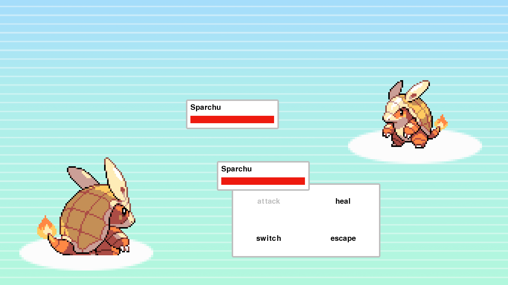
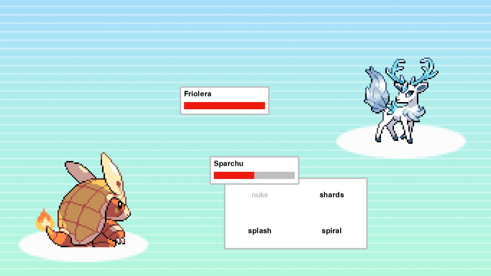
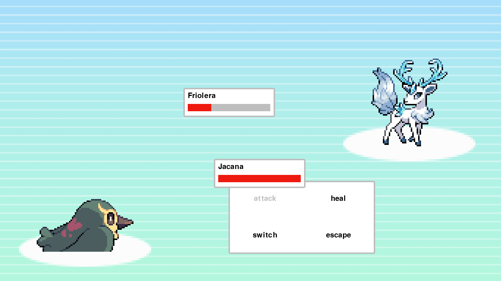
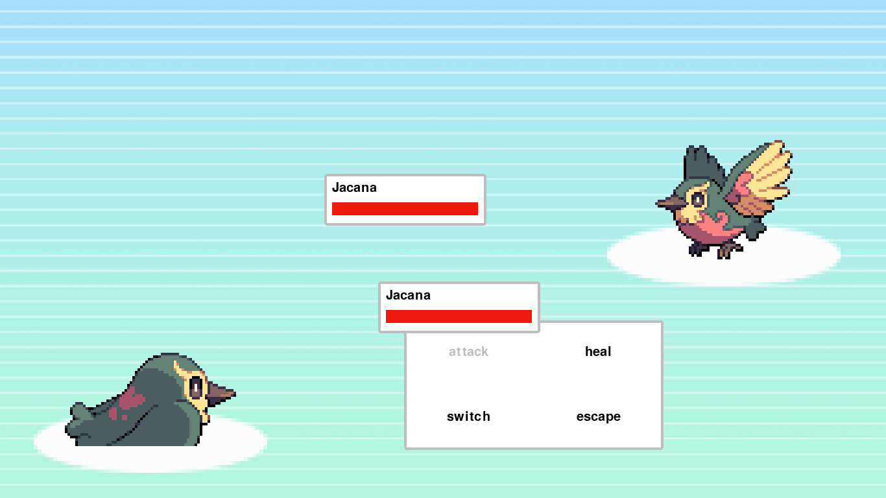
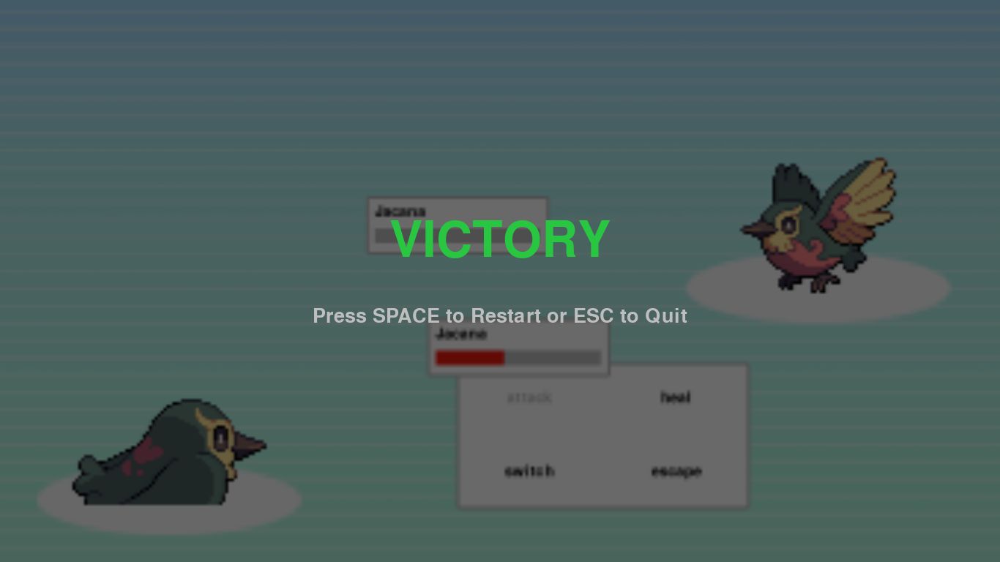
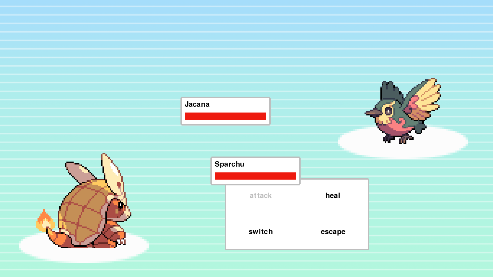
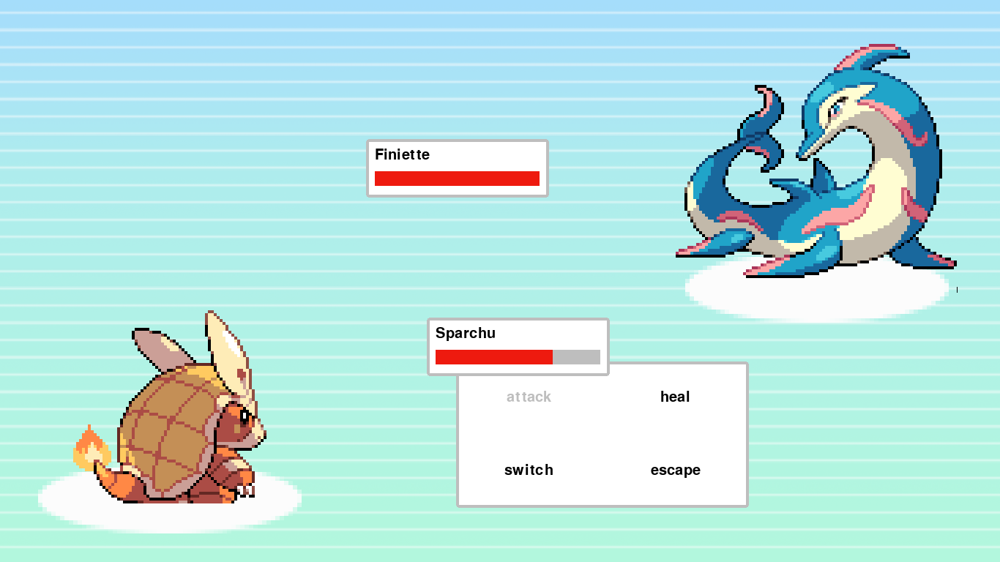
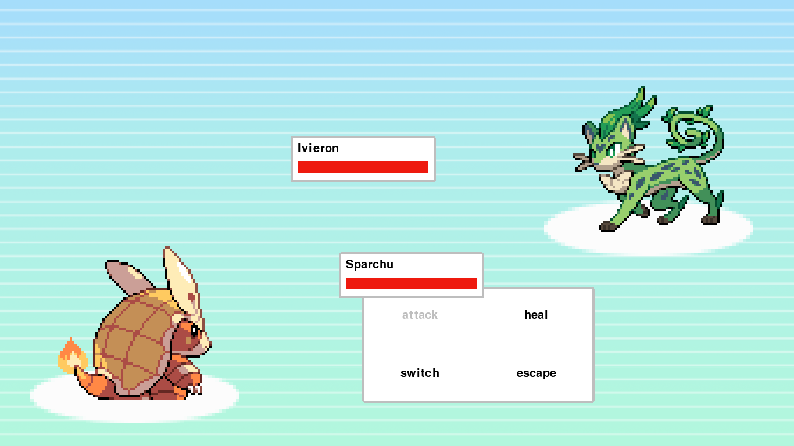
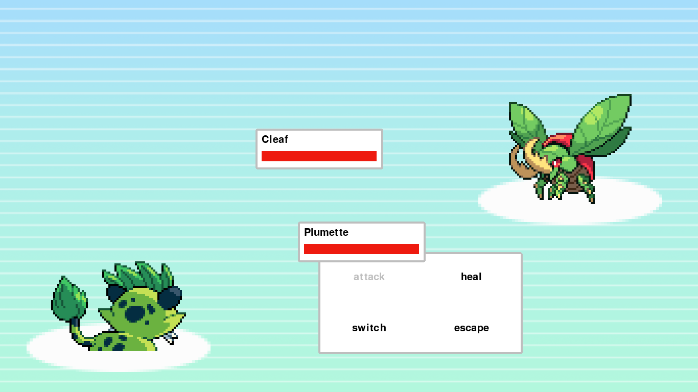

# 🐉 Monster Battle ⚔️

[](https://github.com/ShivamKR12/Monster-battle/actions/workflows/build.yml)
[](https://github.com/ShivamKR12/Monster-battle/releases/latest)

A fully-featured, turn-based monster battling game built in Python using **Pygame-CE**. Assemble your team, master the elemental type matchups, and defeat your opponents to achieve victory!

## 🌐 Play Online

Play the web version directly in your browser (powered by pygbag + WebAssembly):

👉 https://shivamkr12.github.io/Monster-battle-Web/

No installation required.
Works on desktop and mobile browsers with keyboard, mouse, and touch controls.

## ✨ Features

- **Turn-Based Combat:** Classic RPG-style battling system.
- **Elemental Matchups:** Strategic combat featuring Fire, Water, Plant, and Normal types. 
- **Roster Management:** Switch dynamically between your active team of monsters during battle.
- **Animations & Audio:** Animated attack sprites, screen shakes, and engaging sound effects.
- **Dynamic UI:** Intuitive, grid-based menus with dynamic health bars and battle logs.
- **Cross-Platform Support:** Play on Desktop, Android, and Web browsers.
- **Touch Controls:** Full touch and mouse support alongside keyboard controls.
- **Fullscreen Experience:** Automatically adapts to your display resolution.
- **WebAssembly Powered:** Browser version built using pygbag + pygame-ce.

## 📸 Screenshots

<p align="center">
  
  
  
  
  
  
  
  
  
</p>

## 🎮 Controls

### Keyboard Controls

| Key | Action |
| :--- | :--- |
| **Arrow Keys (↑ ↓ ← →)** | Navigate menus / Select monsters and attacks |
| **Spacebar** | Confirm selection / Action |
| **ESC** | Go back (in menus) / Quit Game |

### Touch / Mouse Controls

| Input | Action |
| :--- | :--- |
| **Tap / Left Click** | Select menu options, attacks, monsters, and buttons |
| **Tap Restart/Quit Buttons** | Control end-game menu on mobile and web |

## 🚀 How to Play (Standalone Executable)

If you have downloaded the `.exe` version of the game:
1. Simply double-click `MonsterBattle.exe` (or `main.exe`).
2. The game will launch in fullscreen mode automatically. No installation required!

## 🛠️ How to Run from Source

If you want to run or modify the game's Python source code, follow these steps:

1. **Clone or Download** this repository.
2. **Create a Virtual Environment** (Recommended):
   ```bash
   python -m venv venv
   venv\Scripts\activate   # Windows
   # source venv/bin/activate # Mac/Linux
   ```
3. **Install Dependencies:**
   ```bash
   pip install -r requirements.txt
   ```
4. **Run the Game:**
   ```bash
   python main.py
   ```

## 📦 Building the Executable

To compile the game into a standalone `.exe` using PyInstaller, run the following command from the root project directory:

```bash
pyinstaller --noconsole --onefile --name MonsterBattle --icon=icon.ico --add-data "icon.ico;." --add-data "images;images" --add-data "audio;audio" main.py
```

*The compiled game will be generated inside the `dist` folder.*

## 🌍 Running the Web Version (pygbag)

This project supports browser builds using pygbag.

### Install pygbag

```bash
pip install pygbag
```

### Run Local Web Server

```bash
pygbag main.py
```

Then open:

```text
http://localhost:8000
```

### Build for Production

```bash
pygbag --build main.py
```

The generated web build will appear inside the `build/web` directory.
